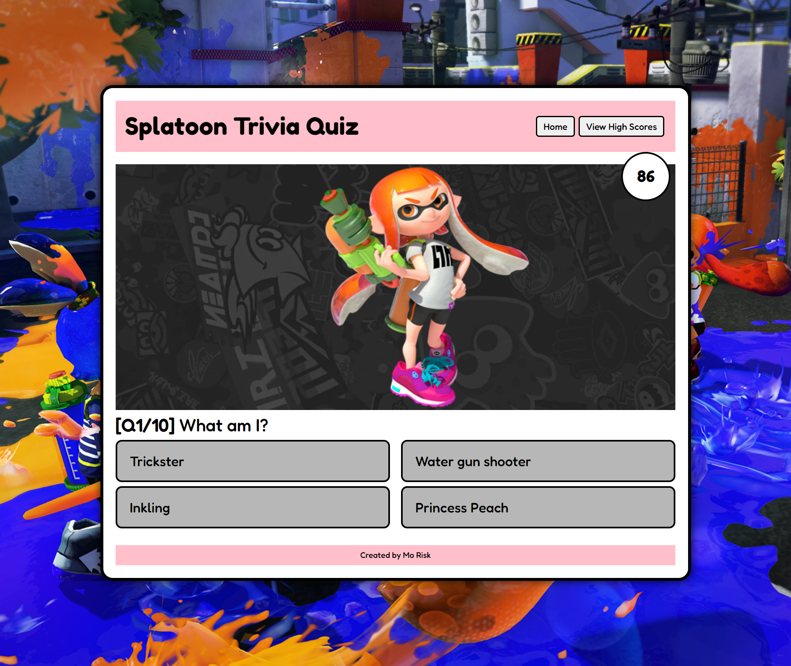
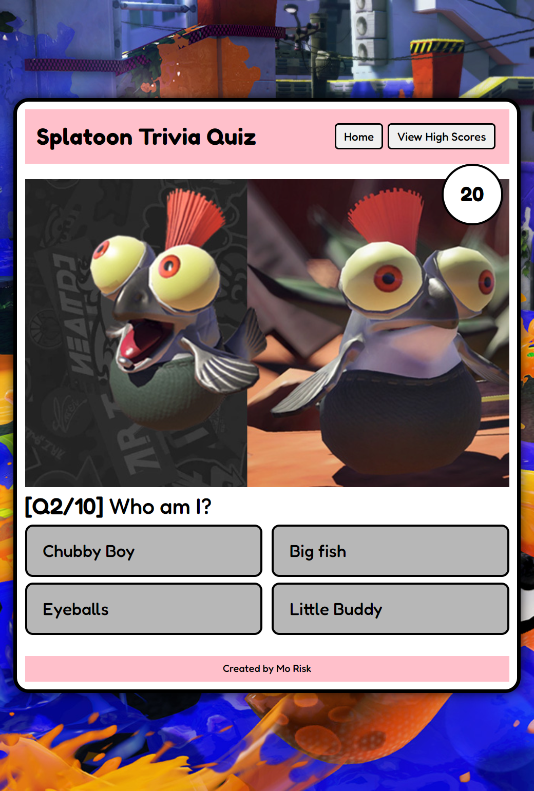
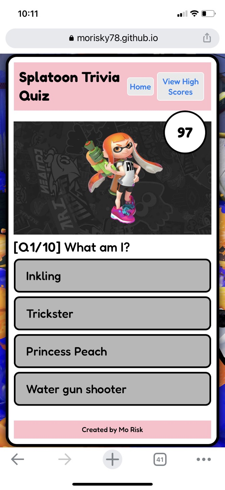

# Splatoon Trivia Quiz

## Description

This webpage is created to make 
a timed quiz with multiple-choice questions, which run in the browser with features that dynamically updates HTML and CSS powered by JavaScript. 


## Usage

- The URL of the Deployed page:  
https://morisky78.github.io/splatoon-quiz/

- The URL of the GitHub repository:  
https://github.com/morisky78/splatoon-quiz/


### How to play
- Click Start! button.
- Users play the Splatoon game trivia quiz within 100 seconds. There are 10 quiz sets and choices are shown in random order. 
- The time left after the user finish all question will be the final score.
- If the user can't finish all questions, the game will be over. and score 0.
- When the user answers a question incorrectly, 10 seconds is subtracted from the clock, and the clock will be highlighted.
- Users can save the score with their initials on the local storage.
- Users can delete the recode by clicking 'Reset High Scores'


### Responsive user interface
The screenshots of the page are attached below to show the layout difference in 3 different screen sizes.





### Update quiz specification
- Update quiz sets : quizSet.js  
All question sets are stored on a separate js file, quizSet.js with following format. The app will work accordingly when you add or remove quizSet object. There are two question sets that are commented out, and they can be added by uncomment the lines.
```javascript
var quizSet = [
{
    q: "What is my name? ",
    imgsrc : "assets/images/q/8.jpg",
    choices: ["Marie", "Marina", "Pearl", "Callie"],
    answer: "Marie"
}
]
```

- Update the play time and delay time: script.js
The total play time and the delay time (the delay time before displaying next question after user clicks an answer) can be modified by changing the values below on script.js file. Current total time: 100 sec. / delay time: 1 sec.

```javascript
// total game time in second
var gameTime = 100;
// delay after a choice is clicked. (in millisecond)
var delaySec = 1000;
```


## Credits
For deeper understanding, I researched related topics and referred to following articles.

- sort array  
https://developer.mozilla.org/en-US/docs/Web/JavaScript/Reference/Global_Objects/Array/sort

- Randomize array in-place using Durstenfeld shuffle algorithm 
https://stackoverflow.com/questions/2450954/how-to-randomize-shuffle-a-javascript-array

- Using Nintendo images on my website
https://slate.com/technology/2014/11/no-license-needed-to-put-nintendo-characters-in-non-commercial-media-says-president-saturo-iwata.html